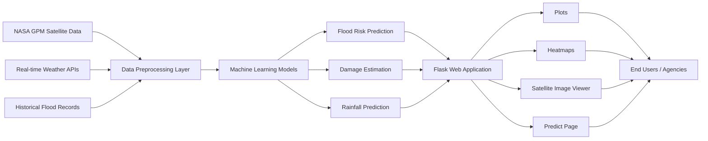
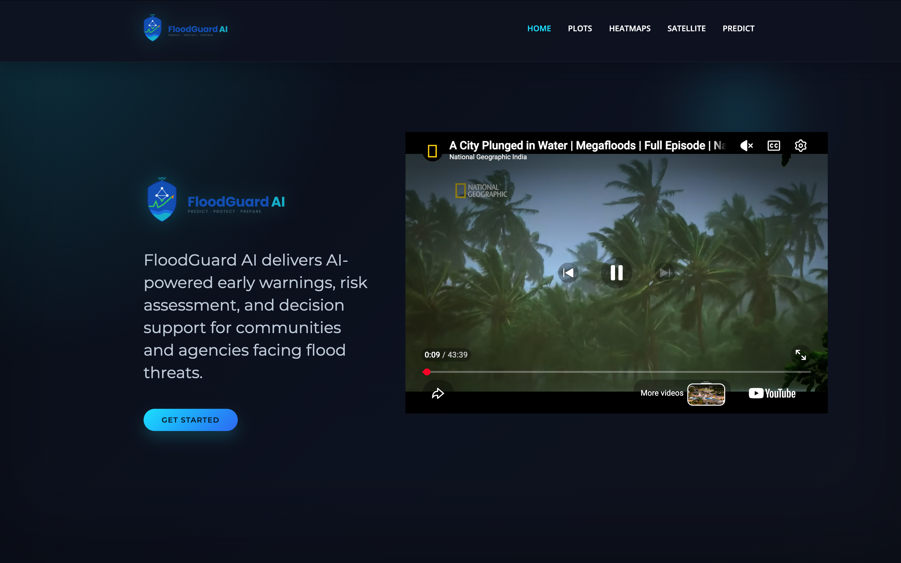
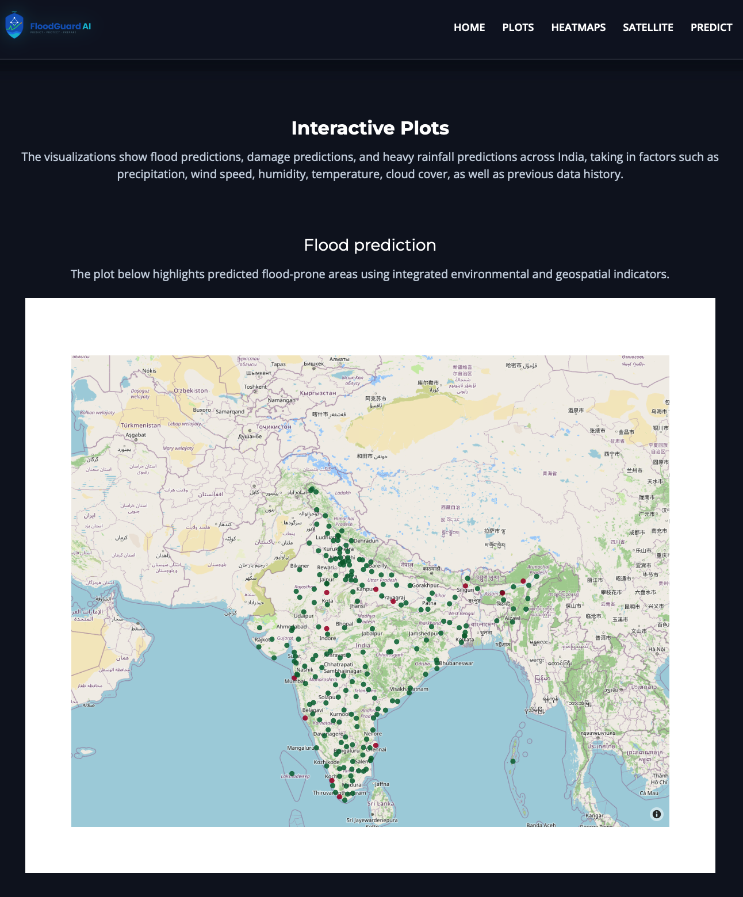
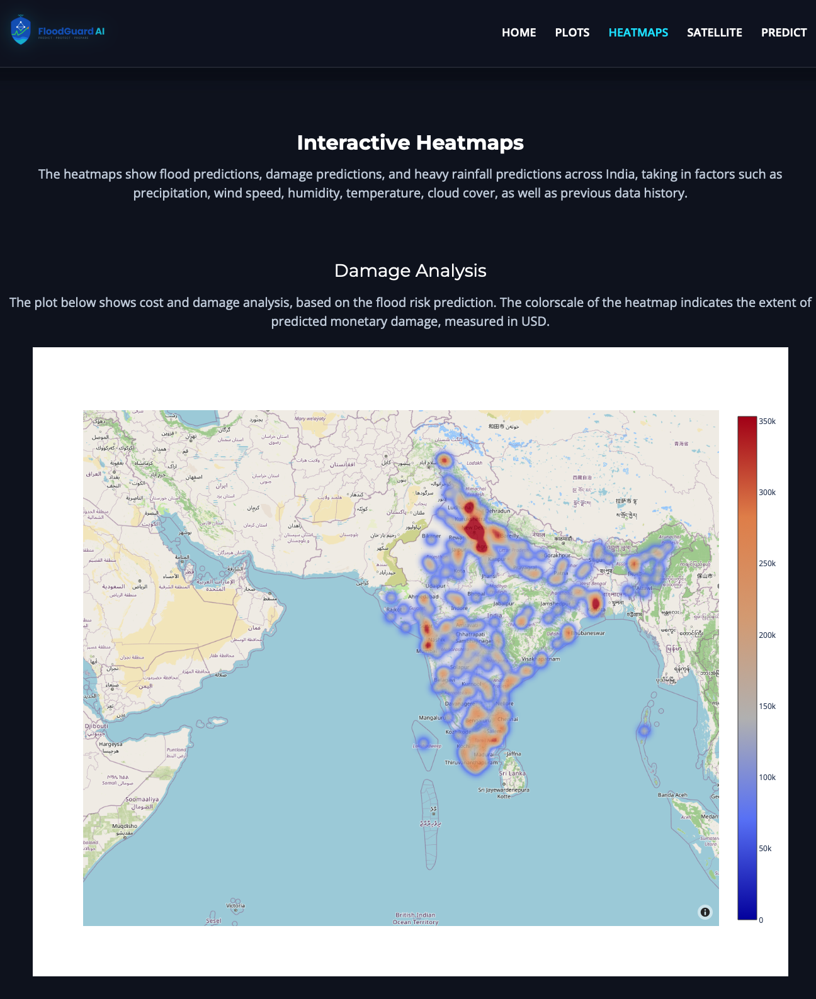
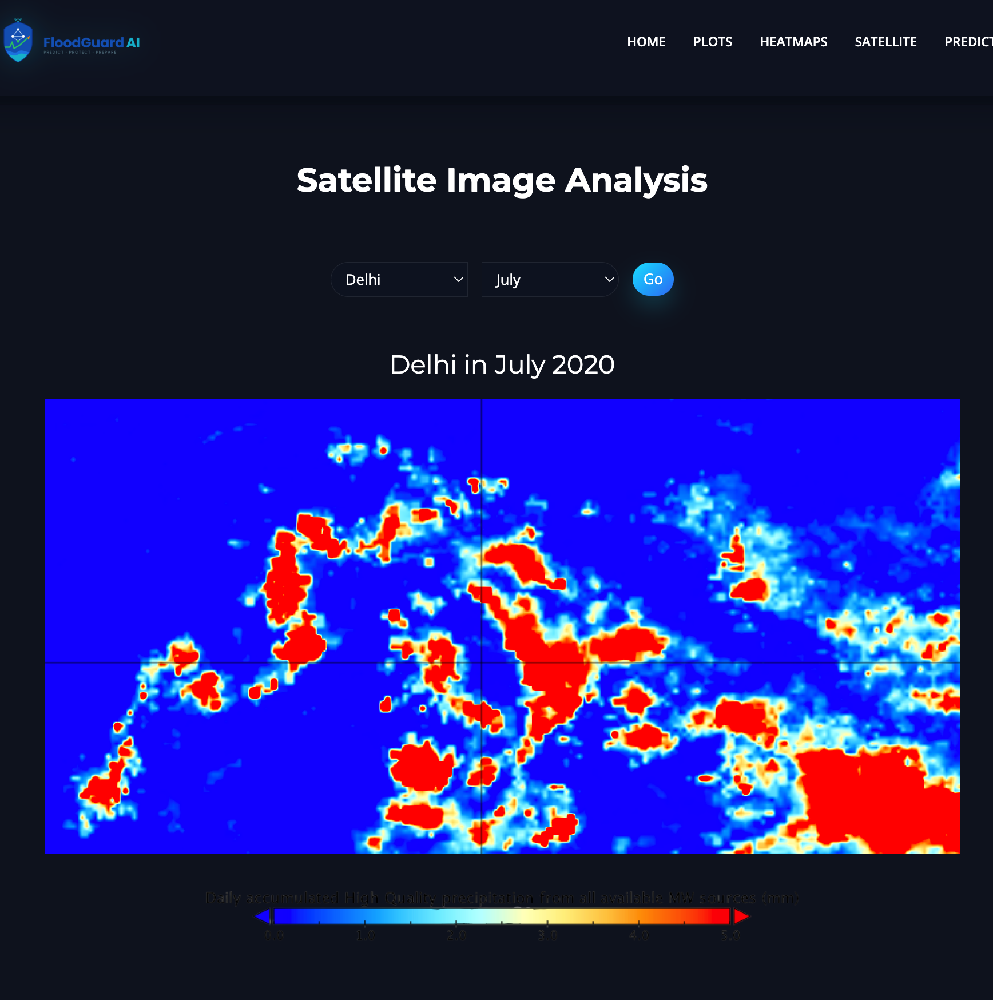
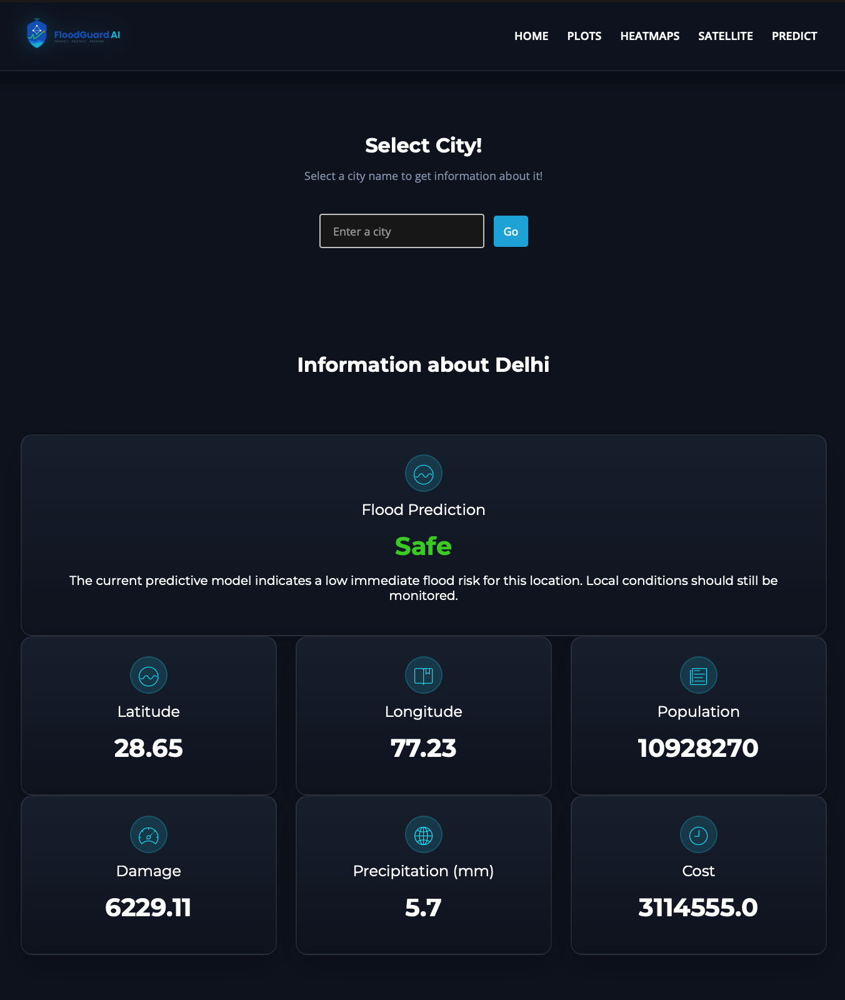

<div align="center">

# 🌊 FloodGuard AI

### AI-Powered Flood Prediction & Disaster Management Platform

*Turning environmental and geospatial data into actionable intelligence for disaster preparedness and response.*

<a href="https://www.python.org/" target="_blank">
  
</a>

<a href="https://flask.palletsprojects.com/" target="_blank">
  
</a>

<a href="https://scikit-learn.org/" target="_blank">
  
</a>

<a href="https://gpm.nasa.gov/" target="_blank">
  
</a>

<a href="https://opensource.org/license/mit/" target="_blank">
  
</a>

<br><br>

<a href="https://floodguard-ai-v2.onrender.com/" target="_blank">
  
</a>

<a href="https://render.com/" target="_blank">
  
</a>

</div>

---

## Table of Contents

- [Problem Statement](#problem-statement)
- [Novelty & Key Themes](#novelty--key-themes)
- [Features](#features)
- [Methodology / How It Works](#methodology--how-it-works)
- [Architecture](#architecture)
- [Tech Stack](#tech-stack)
- [Installation & Usage](#installation--usage)
- [Project Structure](#project-structure)
- [Screenshots](#screenshots)
- [Team](#team)
- [Mentor](#mentor)
- [Institution](#institution)
- [Acknowledgments](#acknowledgments)
- [Future Work](#future-work)
- [License](#license)

---

<a id="problem-statement"></a>
## Problem Statement

Floods remain one of the most destructive and recurring natural hazards worldwide. Climate variability, extreme rainfall, changing river dynamics, and rapid urbanization continue to increase vulnerability in flood-prone regions. In many areas, communities and disaster-response agencies lack fast, reliable access to interpretable flood risk insight — making it difficult to prioritize resources and act before conditions worsen.

**FloodGuard AI** was built to close this gap by converting fragmented environmental and geospatial data into clear, actionable intelligence that supports faster, better-informed disaster response decisions.

---

<a id="novelty-key-themes"></a>
## Novelty & Key Themes

FloodGuard AI distinguishes itself through:

- **Multimodal data fusion** — combining meteorological observations, satellite-derived precipitation products, historical flood records, and geospatial context into a single analytical pipeline.
- **ML-driven early warning** — machine learning models estimate flood likelihood and downstream damage, not just raw weather metrics.
- **Satellite-backed validation** — real NASA GPM precipitation data grounds predictions in observed reality rather than forecasts alone.
- **Decision-support visualization** — interactive dashboards designed to be equally usable by technical analysts and non-technical decision-makers.
- **Real-time, global querying** — any city worldwide can be assessed instantly via live weather data ingestion.

---

<a id="features"></a>
## Features

### Plots

Interactive bubble-plot visualizations across India, built from precipitation, wind speed, humidity, temperature, cloud cover, and historical data:

- **Flood Prediction Plot** — machine-learning-predicted flood locations, marked with red dots.
- **Precipitation Plot** — current precipitation intensity, with bubble size indicating rainfall volume.
- **Damage Analysis Plot** — estimated monetary damage (USD) per location, sized by predicted flood risk and population.

### Heatmaps

Continuous colorscale heatmaps covering the same three domains:

- **Damage Analysis Heatmap** — color intensity reflects predicted monetary damage.
- **Precipitation Heatmap** — darker red indicates higher precipitation volume.
- **Flood Prediction Heatmap** — darker red zones indicate higher flood likelihood based on current environmental factors.

### Satellite Image Analysis

Geo-referenced precipitation imagery per city and month, generated from NASA's **Global Precipitation Measurement (GPM)** netCDF4 datasets using `numpy`, `matplotlib`, and `cartopy`, and rendered directly in the web application.

### Predict Page

Enter any city name globally. FloodGuard AI fetches real-time weather data, feeds it into the machine-learning model, and instantly returns:

- Flood risk prediction
- Temperature and maximum temperature
- Humidity
- Cloud cover
- Wind speed
- Precipitation

---

<a id="methodology-how-it-works"></a>
## Methodology / How It Works

1. **Data acquisition** — pull real-time weather data, historical flood records, and NASA GPM satellite precipitation data.
2. **Preprocessing** — clean, normalize, and geospatially align data across sources such as precipitation, temperature, humidity, wind speed, and cloud cover.
3. **Machine learning inference** — feed processed features into trained models to estimate flood probability and projected damage.
4. **Prediction generation** — produce per-location flood, rainfall, and damage predictions.
5. **Visualization** — render results as bubble plots, heatmaps, and satellite overlays through the Flask web interface.
6. **Decision support** — present interpretable outputs for both technical analysts and emergency response decision-makers.

---

<a id="architecture"></a>
## Architecture



---

<a id="tech-stack"></a>
## Tech Stack

| Category | Technologies |
| --- | --- |
| **Language** | Python 3.9+ |
| **Web Framework** | Flask |
| **Machine Learning** | scikit-learn / ML pipelines |
| **Data Processing** | NumPy, Pandas |
| **Geospatial & Visualization** | Matplotlib, Cartopy |
| **Satellite Data** | NASA GPM (netCDF4 format) |
| **Frontend** | HTML, CSS, JavaScript (via Flask templates) |
| **APIs** | Real-time weather data APIs |

---

<a id="installation-usage"></a>
## Installation & Usage

```bash
git clone https://github.com/Chandan24-cell/FloodGuard-AI-v2
cd floodguard-ai

python -m venv venv
source venv/bin/activate      # On Windows: venv\\Scripts\\activate

pip install -r requirements.txt
python app.py
```

Once running, open your browser and navigate to:

```text
http://127.0.0.1:5000
```

You are ready to explore **Plots**, **Heatmaps**, **Satellite Images**, and the **Predict** page.

---

<a id="project-structure"></a>
## Project Structure

```text
floodguard-ai/
├── app.py
├── requirements.txt
├── Procfile
├── data_manipulation_scripts/
├── processed_satellite_images/
├── static/
├── templates/
├── training/
├── doc/Screenshots/
└── README.md
```

---

Quick notes:
- Copy static/frontend/.env.example to static/frontend/.env and set REACT_APP_MAPBOX_TOKEN with a Mapbox token.
- Install and run the prototype:
  cd static/frontend
  npm install
  npm run dev

Then open the Vite dev URL (usually http://127.0.0.1:5000).

## Screenshots

The project includes a set of representative screenshots that showcase the platform's main interfaces and data visualizations.

| Page | Image |
| --- | --- |
| Home |  |
| Plots |  |
| Heatmaps |  |
| Satellite |  |
| Predict |  |

---

<a id="team"></a>
## Team

| Name | Role | Department | Roll No. |
| --- | --- | --- | --- |
| **Chandan Kumar Sah** | Team Lead | AI/Machine Learning | 24AM070 |
| **Saurav Shah Teli** | Team Member | Computer Science and Engineering | 24CS290 |
| **Sitesh Kumar Paswan** | Team Member | Information Technology | 24IT131 |

**Department:** Artificial Intelligence and Machine Learning

---

<a id="mentor"></a>
## Mentor

**Mr. Anish Antony**  
Assistant Professor II

---

<a id="institution"></a>
## Institution

**KPR Institute of Engineering and Technology**  
Avinasi Road, Arasur, Coimbatore – 641407

---

<a id="acknowledgments"></a>
## Acknowledgments

- **NASA Global Precipitation Measurement (GPM) Mission** — for open satellite precipitation datasets.
- The open-source Python geospatial and scientific computing community (`numpy`, `matplotlib`, `cartopy`).
- Faculty mentorship and institutional support from KPR Institute of Engineering and Technology.

---

<a id="future-work"></a>
## Future Work

- Expanding regional coverage beyond India to additional flood-prone geographies.
- Improving forecast precision through enhanced model architectures and richer training data.
- Integrating additional remote sensing inputs for finer-grained risk assessment.
- Strengthening the platform's utility for emergency management, resilience planning, and community preparedness.

---

<a id="license"></a>
## License

This project is licensed under the **MIT License** — see the [LICENSE](LICENSE) file for details.

<div align="center">

Made with 💙 for safer, more resilient communities.

</div>
